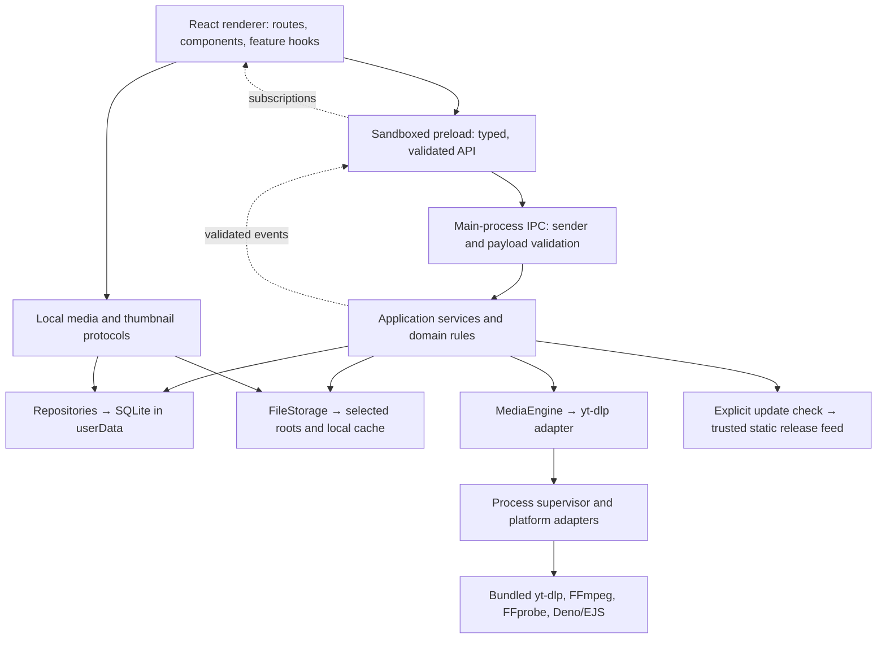

# Arima implementation plan

**Intended destination:** `/Users/gimnath/Developer/Dev_Space/Products/arima/IMPLEMENTATION_PLAN.md`

**Save status:** Saved at the intended destination. Phase 1 completed on 2026-09-19.

**Baseline:** 2026-09-19. Read `agent.md` completely, inspected the HTML prototype, and extracted all 24 pages of the requirements PDF.

## 1. Project summary

Arima is a local-first desktop media manager for students, developers, creators, and other users maintaining authorized offline media libraries.

Primary workflow:

**Import URL → Analyze → Select → Configure → Download → Organize → Watch → Resume**

V1 targets macOS Apple Silicon, macOS Intel, and Windows x64. It includes single-media and playlist downloads, persistent queues, local collections, download history, playback, viewing progress, settings, external storage, and manually initiated update checks.

SQLite, metadata, thumbnails, logs, and playback history stay on the device. The database lives under Electron’s `userData`; downloaded media uses user-selected storage. Network activity occurs only for explicitly requested analysis, downloads, or update checks.

Excluded from V1: cloud services, accounts, authentication/cookie import, uploads, synchronization, Linux distribution, mobile apps, browser extensions, subtitles, transcripts, notes, bookmarks, semantic search, AI features, social features, and DRM circumvention.

### Progress tracker

This plan’s phase numbers supersede the broader implementation headings in `agent.md`. Those headings remain requirements references.

| Phase | Name | Status | Last Updated | Notes |
| ----- | ---- | ------ | ------------ | ----- |
| 1 | Architecture and secure scaffold | Completed | 2026-09-19 | Secure scaffold validated |
| 2 | SQLite and packaged foundation | Not Started | 2026-09-19 | Prove native-module packaging early |
| 3 | Shared contracts and design system | Not Started | 2026-09-19 | Establish reusable boundaries |
| 4 | Shell, Home, Library, and Settings UI | Not Started | 2026-09-19 | Typed fixtures only |
| 5 | Analyzer, Downloads, and Player UI | Not Started | 2026-09-19 | Typed fixtures only |
| 6 | Persistent settings and storage locations | Not Started | 2026-09-19 | Future-download location changes |
| 7 | Bundled tools and process adapters | Not Started | 2026-09-19 | Include required JavaScript runtime |
| 8 | URL analysis and local metadata | Not Started | 2026-09-19 | No full-media download |
| 9 | Persistent queue and scheduling | Not Started | 2026-09-19 | Deterministic mock engine |
| 10 | Download execution and processing | Not Started | 2026-09-19 | Safe files and verified output |
| 11 | Download controls and recovery | Not Started | 2026-09-19 | Pause, resume, cancel, retry |
| 12 | Library, collections, and history | Not Started | 2026-09-19 | Transactional registration |
| 13 | Removal and storage management | Not Started | 2026-09-19 | Record-only and physical deletion |
| 14 | Local playback and media protocol | Not Started | 2026-09-19 | Seeking and codec fallback |
| 15 | Watch progress and Continue Watching | Not Started | 2026-09-19 | Persist across restart |
| 16 | Platform integration and manual updates | Not Started | 2026-09-19 | Trusted installer-page action |
| 17 | End-to-end verification and hardening | Not Started | 2026-09-19 | Close remaining integration gaps |
| 18 | macOS Apple Silicon distribution | Not Started | 2026-09-19 | Signed, notarized release validation |
| 19 | macOS Intel distribution | Not Started | 2026-09-19 | Native Intel validation |
| 20 | Windows x64 distribution and V1 audit | Not Started | 2026-09-19 | Installer and final acceptance |

Allowed statuses: `Not Started`, `In Progress`, `Blocked`, `Completed`.

A phase becomes `Completed` only after its implementation, tests, validation commands, and acceptance criteria pass. Record exact blockers instead of treating untested platform behavior as complete.

## 2. Current project status

### Observed structure

The directory contains:

- `agent.md`: architectural and implementation requirements.
- `requirement-spec.pdf`: product requirements, including FR-001–FR-054.
- `index.html`: approximately 65 KB, 201 lines, standalone HTML/CSS/JavaScript prototype.
- `.DS_Store`: operating-system metadata.

There is no Git repository, package manifest, lockfile, installed project dependency tree, application source structure, Electron entry point, SQLite database, migration system, build configuration, or test suite.

The inspection environment is macOS arm64 with Node 24.3.0 and pnpm 10.15.1. These are host tools, not project dependencies.

### Existing prototype

The prototype is branded **MediaVault**, which must become **Arima** in the application while preserving the original reference file.

Existing screens:

- Home.
- Analysis loading.
- Playlist preview and configuration.
- Downloads.
- Download history.
- Library.
- Settings.
- Player and error modals.

Existing presentational patterns include sidebar navigation, cards, tables, status badges, progress bars, tabs, search fields, dialogs, toast notifications, and an offline banner.

### Verification and limitations

| Area | Evidence | Assessment |
| --- | --- | --- |
| JavaScript syntax | Extracted inline script passed `node --check` | Syntax verified |
| Element references | No duplicate IDs or unresolved literal `getElementById` references | Basic static consistency verified |
| Navigation and selection | Event handlers change screen classes and checkbox counts | Prototype interactions implemented in source; browser execution unverified |
| Search | Filters hard-coded history and collection arrays | Fixture-only functionality |
| Analysis | A timer always opens the same playlist | Mocked; no URL validation or engine |
| Queue submission | Displays a toast and changes screens | Does not create download jobs |
| Retry | Displays a success toast | Does not restart a process |
| Playback | Toggles icons; no `<video>` or `<audio>` element exists | Mocked |
| Settings | Changes visual controls only | No persistence |
| Storage and tool status | Hard-coded values | Not operational checks |
| Network dependencies | No remote script, stylesheet, or image references found | Self-contained visual reference |

### Missing functionality and technical debt

All production V1 capabilities remain to be implemented.

Specific prototype gaps:

- No dedicated single-media preview or functional collection details.
- No real download controls, directory picker, update check, or deletion workflow.
- Automatic-update controls conflict with the explicit-network policy.
- Light-theme selection does not implement a light theme.
- Fake macOS window controls should become real platform controls.
- Dynamically assembled `innerHTML` must not be reused with untrusted provider metadata.
- Dense, single-file CSS and JavaScript need conversion into focused modules.
- Modal focus management, keyboard semantics, contrast, and resizing require verification.
- Breakpoints at 1020 px and 820 px hide information; production layouts must retain access to essential actions and progress.

No application build or application tests could be run because none exist.

## 3. Final architecture



### Responsibilities and dependency direction

- **Renderer:** presentation, navigation, interaction, accessible controls, view state, and HTML5 playback. No Node, process, filesystem, database, or direct provider access.
- **Preload:** expose `window.arima` with named domain methods. Validate requests, responses, and events; return listener cleanup functions. Expose no generic channel invocation.
- **Main process:** startup, windows, IPC authorization, service composition, queue ownership, repositories, native dialogs, update checks, and lifecycle coordination.
- **Domain modules:** pure download transitions, configuration rules, duplicate identity, ordering, and progress calculations.
- **Repositories:** the only application access to SQLite. Use bounded queries and transactions.
- **Infrastructure adapters:** executable resolution, process lifecycle, filesystem operations, provider normalization, and operating-system differences.
- **External tools:** extraction, transfer, probing, merging, and supported conversion. They do not determine application policy or write arbitrary renderer-supplied paths.

Dependencies point from presentation to contracts, from services to domain interfaces, and from adapters to those interfaces. Bootstrap composes implementations. Shared modules import neither Electron nor application layers.

Use secure BrowserWindow defaults, restrictive CSP, blocked remote navigation and window creation, denied permissions by default, and validated top-frame IPC senders.

Bundle preload dependencies into a sandbox-compatible artifact; do not assume sandboxed preload can load arbitrary Node modules. [Electron sandbox documentation](https://www.electronjs.org/docs/latest/tutorial/sandbox)

### Required interfaces

| Interface | Responsibility |
| --- | --- |
| `MediaEngine` | Provider-neutral metadata, download execution, capabilities, version |
| `MediaAnalyzer` | Analysis sessions, cancellation, normalization, local metadata caching |
| `DownloadManager` | Execute one job and coordinate processing/finalization |
| `DownloadQueue` | Durable ordering, transitions, concurrency, controls, recovery |
| `LibraryRepository` | Media, collections, search, registration, removal |
| `SettingsRepository` | Validated settings and persistent defaults |
| `PlaybackProgressRepository` | Positions, completion, recently watched queries |
| `FileStorage` | Approved roots, safe paths, staging, finalization, deletion |
| `MediaProtocol` | Resolve media IDs and serve local bytes with range support |

### IPC contracts

Use domain operations under:

- `analysis.*`: start, cancel, retrieve result.
- `downloads.*`: enqueue, list, pause, resume, cancel, retry.
- `library.*`: list, search, collection details, remove, storage information.
- `player.*`: open, save position, mark unwatched, open externally.
- `settings.*`: get and update.
- `dialog.*`: select storage directory.
- `app.*`: application/tool versions, check updates, open approved release page.

All commands and queries use a shared Zod-validated result envelope:

```ts
type Result<T> =
  | { ok: true; data: T }
  | { ok: false; error: AppError };
```

`AppError` includes a stable code, safe message, retryability, and optional correlation ID. Raw process output and stack traces remain in redacted local logs.

Events cover progress, download status, queue changes, storage problems, engine errors, and update availability. Events include stable IDs and revisions where ordering matters. Subscriptions must return unsubscribe functions; reconnecting views refresh an authoritative snapshot.

Directory selection returns an opaque root ID and display path. Commands accept root IDs or media IDs, never arbitrary filesystem paths or executable arguments.

### Persistence

Database: `userData/arima.sqlite`. Use foreign keys, WAL, bounded transactions, and versioned committed migrations. Startup migrations finish before services accept commands. Migration failure opens a recovery state without resetting user data.

| Table | Purpose and constraints |
| --- | --- |
| `collections` | Stable ID, source identity, normalized URL, title, thumbnail reference, timestamps |
| `media_items` | Completed rendition, source identity, format/quality fingerprint, root-relative file reference, size, duration, timestamps |
| `collection_items` | Collection/media foreign keys and original playlist index; unique membership |
| `downloads` | Job ID, immutable configuration, source snapshot, state, ordering, progress, attempts, error, staging/finalization journal, timestamps |
| `playback_progress` | One row per media item; position, duration, completion, last played, timestamps |
| `settings` | Validated setting keys/values and timestamps |
| `storage_roots` | Main-process-owned root paths and availability information |
| `analysis_sessions`, `analysis_items` | Added with analysis; persist normalized metadata and local thumbnail references |

Use UUIDs, UTC timestamps, indexes for queue state/order, source identity, collection ordering, title queries, and recently watched items.

Duplicate detection uses provider/source identity where available, normalized source URL as fallback, and a rendition fingerprint. Unique completed renditions prevent retry duplication while allowing another format or quality. Do not remove meaningful query parameters during normalization.

### Download lifecycle

Normal flow:

`queued → analyzing → downloading → post_processing → completed`

Alternatives: `paused`, `failed`, `cancelled`, `interrupted`.

- Pause stops owned processes, waits for termination, preserves reusable inputs, then persists `paused`.
- Resume and retry return through `queued`; refresh expiring media URLs without changing the user’s requested configuration.
- Cancel persists the requested keep/delete-partials choice and waits for process termination before cleanup.
- Restart converts abandoned active states to `interrupted`.
- Previously queued jobs and interrupted jobs require explicit user action after restart, preventing unsolicited network activity.
- Resume post-processing from validated source files; discard incomplete derived output.
- Only verified final output can become `completed`.
- Invalid transitions fail with structured errors.

Persist state transitions immediately. Throttle progress database writes to at most once per second per job and renderer progress events to approximately four per second.

Concurrency defaults to two, configurable from one to four. A slot covers the complete job through processing to avoid uncontrolled FFmpeg concurrency.

### Storage and finalization

Use per-job staging directories within the selected destination volume. Sanitize names for both target operating systems; handle reserved names, Unicode, collisions, length limits, traversal, symlinks, and Windows junctions.

Persist finalization intent before moving output. Verify output using FFprobe, rename within the same volume, then transactionally register media and complete the job. Recovery reconciles files and database state after interruption between these steps.

Library location changes affect future downloads only, as selected by the user. Existing roots and file references remain valid. SQLite never moves with the media library.

### Playback and platform behavior

Serve bundled UI, cached thumbnails, and media through restricted custom protocols. Media URLs contain media IDs, not paths. Support bounded streaming, GET/HEAD, byte ranges, correct MIME types, 206 responses, and 416 responses. Do not enable CSP bypass. [Electron protocol documentation](https://www.electronjs.org/docs/latest/api/protocol)

Use native HTML5 media controls first. Unsupported media offers a main-process-owned external-player action. V1 cannot track playback performed in external applications.

Platform adapters own native dialogs, reveal/open actions, process-tree termination, window behavior, and storage availability checks.

## 4. Target folder structure

```text
arima/
├── agent.md
├── requirement-spec.pdf
├── index.html                         # preserved reference
├── IMPLEMENTATION_PLAN.md             # progress and decisions authority
├── package.json
├── pnpm-lock.yaml
├── electron.vite.config.ts
├── electron-builder.yml
├── build/                             # icons, entitlements, installer resources
├── resources/
│   ├── binary-manifest.json
│   ├── licenses/
│   └── bin/
│       ├── darwin-arm64/
│       ├── darwin-x64/
│       └── win32-x64/
├── scripts/                           # verification and packaging tooling
├── src/
│   ├── main/
│   │   ├── bootstrap/
│   │   ├── windows/
│   │   ├── ipc/                       # handlers grouped by domain
│   │   ├── domain/                    # pure rules and interfaces
│   │   ├── services/
│   │   │   ├── analysis/
│   │   │   ├── downloads/
│   │   │   ├── library/
│   │   │   ├── playback/
│   │   │   ├── settings/
│   │   │   └── updates/
│   │   ├── adapters/
│   │   │   ├── media-engine/
│   │   │   ├── processes/
│   │   │   ├── filesystem/
│   │   │   └── platform/
│   │   ├── db/
│   │   │   ├── schema/
│   │   │   ├── migrations/
│   │   │   └── repositories/
│   │   └── protocols/
│   ├── preload/
│   ├── renderer/
│   │   ├── index.html
│   │   ├── app/
│   │   ├── routes/
│   │   ├── features/
│   │   │   ├── home/
│   │   │   ├── analyzer/
│   │   │   ├── downloads/
│   │   │   ├── history/
│   │   │   ├── library/
│   │   │   ├── player/
│   │   │   └── settings/
│   │   ├── components/
│   │   ├── stores/
│   │   ├── hooks/
│   │   ├── styles/
│   │   └── lib/
│   └── shared/
│       ├── contracts/
│       ├── schemas/
│       ├── types/
│       ├── constants/
│       └── errors/
├── tests/
│   ├── fixtures/
│   ├── unit/
│   ├── integration/
│   └── e2e/
└── docs/
    ├── architecture.md
    ├── requirements-traceability.md    # generated from the plan
    └── release/
```

Create folders when used, not as an empty speculative framework. Keep renderer fixtures outside production data paths. Avoid broad barrel exports that create circular dependencies.

## 5. Technology decisions

| Technology | Decision and reason |
| --- | --- |
| Electron | Native desktop integration and bundled Chromium on all required targets |
| React | Component-based recreation of the supplied UI |
| TypeScript | Strict mode across main, preload, renderer, and tests |
| Tailwind CSS | Locally compiled styling using extracted reference tokens |
| electron-vite | Separate builds for main, preload, and renderer |
| pnpm | One package manager and committed lockfile |
| React Router | Local application routes; no server-rendering framework |
| Zustand | Small feature/UI stores; SQLite remains authoritative |
| Zod | Shared runtime validation of IPC and normalized external data |
| SQLite / better-sqlite3 | Embedded local persistence and transactions |
| Drizzle ORM / Kit | Typed repositories and reviewed SQL migrations |
| electron-log | Rotating, redacted local logs |
| Vitest / React Testing Library | Domain and renderer behavior tests |
| Playwright | Electron workflow and packaged smoke tests |
| electron-builder | DMG/ZIP and NSIS packaging |
| yt-dlp | Provider adapter for extraction and downloading |
| FFmpeg / FFprobe | Merge, supported conversion, and output verification |
| Deno and bundled EJS | Required runtime support for full YouTube extraction; managed as bundled tools |

Native SQLite must be rebuilt for Electron’s ABI and validated inside packaged artifacts. Node-only tests do not establish Electron compatibility. [Electron native-module documentation](https://www.electronjs.org/docs/latest/tutorial/using-native-node-modules)

Bundle required EJS components and the selected JavaScript runtime; do not download executable components at application startup. [yt-dlp EJS documentation](https://github.com/yt-dlp/yt-dlp/wiki/EJS)

### Compatible dependency baseline

Registry inspection identified these candidate versions:

- Node 24.21.0; pnpm 10.15.1.
- Electron 44.4.3.
- React/React DOM 19.3.0.
- TypeScript 6.0.3.
- electron-vite 5.0.0, Vite 7.3.6, React plugin 5.2.0.
- Tailwind and its Vite plugin 4.3.3.
- React Router 8.4.0, Zustand 5.0.15, Zod 4.6.5.
- better-sqlite3 13.0.3, Drizzle ORM 0.45.2, Drizzle Kit 0.31.10.
- electron-log 5.4.4, electron-builder 26.15.3.
- Vitest 5.0.1, React Testing Library 16.3.3, Playwright 1.63.0.

These are a starting candidate set, **not an installed or verified lockfile**. Phase 1 must validate installation, peer compatibility, type checking, linting, and builds before recording the exact resolved stack.

Avoid blindly selecting all latest versions: electron-vite 5 declares Vite support through major 7, while current TypeScript ESLint declares TypeScript support below 6.1. [electron-vite package metadata](https://registry.npmjs.org/electron-vite/5.0.0), [TypeScript ESLint package metadata](https://registry.npmjs.org/typescript-eslint/8.70.0)

### Rejected alternatives

- Next.js, Express, NestJS, remote databases, and cloud services: unnecessary and inconsistent with local-first requirements.
- Renderer-side SQLite, filesystem access, or direct child processes: violate privilege boundaries.
- JSON/localStorage as the queue database: inadequate transactional recovery.
- Provider-specific UI models: prevent engine replacement.
- Unix process suspension as pause: cannot provide consistent Windows behavior.
- CDN styling, remote fonts, and remotely executable UI: violate packaging and offline constraints.
- Automatic updates or independent engine self-updates: outside selected V1 behavior.
- Full video transcoding as an automatic fallback: adds substantial runtime and codec complexity; disable unsupported combinations clearly.

### Product defaults

- Dark appearance matching the reference; native system font stack.
- Initial window 1280 × 800; minimum 800 × 600 with scrollable content.
- Default media root: `Arima` under Electron’s platform video directory.
- Default quality: Best Available. Default format: MP4.
- Formats: MP4, MKV, WebM, M4A, MP3 where supported.
- Quality options: Best, 2160p, 1440p, 1080p, 720p, 480p, Audio Only.
- Filename styles: title or title plus source ID; playlist ordering prefixes remain mandatory.
- Completion threshold: 90%, configurable.
- Save playback approximately every five seconds and on pause, seek completion, end, and orderly close.
- Update checks are manual and open a trusted installer page, as selected by the user.
- No automatic retries or automatic restart of network work after application relaunch.

## 6. Implementation phases

### Common phase requirements

The fields below apply to every phase, in addition to its individual entry:

- **Status:** `Not Started` initially.
- **Existing files:** always inspect `agent.md`, this plan, and the relevant source introduced by dependencies.
- **Plan modification:** update the tracker, traceability statuses, validation evidence, and handover log.
- **Validation:** run `pnpm check` after code changes. It must perform linting, strict type checking, unit/component tests, and production compilation.
- **Native tests:** `pnpm test:integration` must execute SQLite-dependent checks in an Electron-compatible runtime.
- **E2E tests:** `pnpm test:e2e` uses an injected mock media engine and isolated userData/storage.
- **Packaging:** `pnpm package:dir`, `pnpm smoke:packaged`, and target packaging commands are introduced before use.
- **Security:** shared boundary requirements apply throughout; no phase may temporarily expose unrestricted privileged APIs.
- **Exclusions:** implement only the named phase. Production features belonging to subsequent phases remain excluded.
- **Handover:** record changed files, commands and results, limitations, remaining work, and the next phase’s entry conditions.

### Phase 1 — Architecture and secure scaffold

**Goal:** Create a maintainable, runnable Electron foundation.

**Requirements:** Architectural boundaries, strict TypeScript, local-first operation, FR-051–054.

**Dependencies:** None.

**Existing:** All three supplied inputs.

**Create:** Package/build configuration, application entry points, bootstrap/windows modules, initial test configuration, `docs/architecture.md`, `.gitignore`.

**Modify:** New configuration and plan only; preserve root `index.html`.

**Tasks and reusable modules:**

- Establish Git tracking if the directory still has no repository; do not publish or create a remote.
- Install and lock a mutually compatible stack.
- Configure strict TypeScript, aliases, import boundaries, linting, formatting, and local Tailwind.
- Create secure BrowserWindow and bundled UI protocol.
- Establish service composition and the required domain interface boundaries.
- Document component, analysis, lifecycle, and entity diagrams.
- Implement application metadata through a narrow preload method.

**Database:** Design initial schema; initialization belongs to Phase 2.

**IPC:** `app.getInfo`, structured errors, sender validation foundation.

**Security:** Sandbox, isolation, Node disabled, CSP, blocked navigation and permissions.

**Tests:** Startup, absence of privileged renderer globals, allowed/rejected IPC senders.

**Validation:** `pnpm install`, `pnpm check`, `pnpm dev`, startup smoke test.

**Acceptance:** Development window opens; checks pass; secure defaults are verified.

**Excluded:** Functional screens, database-backed settings, media tools.

**Handover:** Record exact dependency versions and architecture decisions.

### Phase 2 — SQLite and packaged foundation

**Goal:** Prove persistent local storage and native-module packaging before feature work.

**Requirements:** Persistence foundation, FR-044–045 packaging infrastructure, FR-051.

**Dependencies:** Phase 1.

**Existing:** Scaffold, bootstrap, architecture model.

**Create:** DB schema/migrations/repositories, local logging setup, electron-builder configuration, native integration harness, packaged smoke runner.

**Modify:** Bootstrap, package scripts, build configuration.

**Tasks and reusable modules:**

- Create core tables plus storage roots and migration tracking.
- Initialize under `userData`, enable foreign keys/WAL, and run migrations before services.
- Add migration failure UI and non-destructive recovery guidance.
- Configure native rebuilds, `.node` unpacking, migration resources, and future binary resources.
- Separate pure Node tests from Electron-native database tests.
- Package and launch a minimal application on the current host.

**Database:** Initial committed migration; no development seed data in production.

**IPC:** Extend `app.getInfo` with safe readiness information.

**Security:** Redacted logs; no database file paths or SQL API exposed to renderer.

**Tests:** Fresh database, repeated startup, migration failure, foreign keys, packaged SQLite persistence.

**Validation:** `pnpm check`, `pnpm test:integration`, `pnpm package:dir`, `pnpm smoke:packaged`.

**Acceptance:** Packaged application launches and persists data across restart.

**Excluded:** Full target-platform distribution and actual media binaries.

**Handover:** Record native ABI and packaged migration evidence.

### Phase 3 — Shared contracts and design system

**Goal:** Establish reusable, accessible UI and IPC conventions.

**Requirements:** Typed IPC, validation, required UI states.

**Dependencies:** Phases 1–2.

**Existing:** Prototype CSS/components, preload foundation.

**Create:** Shared schemas/contracts/errors, renderer styles/components, typed fixtures.

**Modify:** Preload API typing, renderer root.

**Tasks and reusable modules:**

- Extract reference colors, spacing, typography, radii, shadows, and responsive behavior.
- Recreate buttons, fields, dialogs, tabs, cards, progress/status controls, toast and state panels.
- Define provider-neutral metadata, configuration, queue, library, and playback types.
- Add request/response/event validation helpers and subscription cleanup.
- Make dialog focus management and keyboard behavior reusable.

**Database:** None.

**IPC:** Domain contracts; unimplemented operations remain unavailable rather than returning fake success.

**Security:** Plain-text metadata rendering; sandbox-compatible preload bundle.

**Tests:** Schema rejection, malformed responses/events, unsubscribe behavior, dialog focus.

**Validation:** `pnpm check`.

**Acceptance:** Components reproduce reference patterns and handle keyboard interaction.

**Excluded:** Real service integration.

**Handover:** Record tokens, shared primitives, and contract conventions.

### Phase 4 — Shell, Home, Library, and Settings UI

**Goal:** Build the browsing and configuration screens using fixtures.

**Requirements:** FR-029–030, FR-038–043; shell and Home presentation.

**Dependencies:** Phase 3.

**Existing:** Prototype Home/Library/Settings and common components.

**Create:** App routes, shell, Home, Library/Collection, Settings features.

**Modify:** Renderer composition and navigation.

**Tasks and reusable modules:**

- Implement sidebar, breadcrumbs, local navigation, and keyboard shortcuts.
- Build Continue Watching, library search, collection details, and settings panels.
- Support empty, loading, error, no-results, missing-file, and unavailable-storage fixtures.
- Use desktop resizing behavior that keeps essential actions reachable.
- Omit automatic-update and startup controls not included in V1.

**Database / IPC:** None; typed in-memory fixtures only.

**Security:** No renderer network or privileged access.

**Tests:** Routes, search, keyboard navigation, state views, resizing.

**Validation:** `pnpm check`, renderer smoke checks at 1280 × 800 and 800 × 600.

**Acceptance:** All named screens are navigable and accessible with clearly isolated fixtures.

**Excluded:** Backend integration and real persistence.

**Handover:** List fixture adapters to replace in later phases.

### Phase 5 — Analyzer, Downloads, and Player UI

**Goal:** Complete the remaining V1 presentation workflow.

**Requirements:** FR-001–009, FR-011–019, FR-033–034; download history presentation.

**Dependencies:** Phases 3–4.

**Existing:** Prototype playlist, downloads, history, and player modal.

**Create:** Analyzer, configuration, downloads/history, player presentation modules.

**Modify:** Routes and shared dialogs.

**Tasks and reusable modules:**

- Separate single-media and playlist previews.
- Implement item selection and capability-aware quality/format controls.
- Present progress, processing, paused, interrupted, failed, and cancelled states.
- Add cancel-partials and removal confirmation designs.
- Replace fake player artwork with a reusable player layout, still using fixtures.

**Database / IPC:** None.

**Security:** Validate URL structure at the form boundary; main validation follows in Phase 8.

**Tests:** Select/deselect, zero-selection rejection, configuration restrictions, filters, confirmations.

**Validation:** `pnpm check`, fixture workflow smoke test.

**Acceptance:** Required screens and error states exist without backend coupling.

**Excluded:** Downloads, filesystem effects, real playback.

**Handover:** Document action contracts required by integration phases.

### Phase 6 — Persistent settings and storage locations

**Goal:** Replace settings fixtures with validated persisted preferences.

**Requirements:** FR-010, FR-022, FR-040–042; configurable completion threshold.

**Dependencies:** Phases 2–5.

**Existing:** Settings UI, repositories, storage-root schema.

**Create:** Settings service, settings/root repositories, native directory dialog adapter.

**Modify:** Settings feature, bootstrap and domain IPC.

**Tasks and reusable modules:**

- Persist quality, format, concurrency, filename style, library root, download-root override, completion threshold.
- Resolve destinations as per-job selection, then default download override, then library root.
- Register selected directories in main and return opaque IDs.
- Apply location changes to new jobs only.
- Preserve unavailable root records instead of silently redirecting output elsewhere.

**Database:** Defaults and settings/root repository behavior; migrate only if schema requires it.

**IPC:** `settings.get/update`, `dialog.selectDirectory`.

**Security:** Reject unregistered root IDs and invalid settings; native picker owns path selection.

**Tests:** Restart persistence, invalid values, directory cancellation, unavailable roots, unchanged existing jobs.

**Validation:** `pnpm check`, `pnpm test:integration`.

**Acceptance:** Preferences survive restart and retain correct root ownership.

**Excluded:** Moving existing media and downloading.

**Handover:** Record defaults and destination precedence.

### Phase 7 — Bundled tools and process adapters

**Goal:** Provide controlled execution of application-owned media tools.

**Requirements:** FR-044–046, FR-054.

**Dependencies:** Phases 1–2 and 6.

**Existing:** Build/resource configuration and media interfaces.

**Create:** Binary manifest, acquisition/verification scripts, tool resolver, process supervisor, yt-dlp/FFmpeg adapters.

**Modify:** Packaging resources, application version/status UI.

**Tasks and reusable modules:**

- Pin tools and record platform, architecture, checksum, source, version, and license.
- Bundle standalone yt-dlp, FFmpeg, FFprobe, required EJS components, and Deno.
- Resolve tools from development resources or packaged resources without PATH dependence.
- Spawn with argument arrays and `shell: false`; ignore user yt-dlp configuration and plugin locations.
- Implement timeout, cancellation, bounded output, and owned-process termination.
- Verify host tools now; verify remaining architectures in their distribution phases.

**Database:** None.

**IPC:** Tool versions/readiness through `app.*`.

**Security:** No renderer-supplied arguments, executables, plugins, or silent runtime downloads.

**Tests:** Wrong checksum, missing/wrong-architecture binary, timeout, output limits, metacharacter arguments.

**Validation:** `pnpm check`, `pnpm tools:verify`, process integration tests.

**Acceptance:** Host tools execute from bundled paths without separately installed dependencies.

**Excluded:** UI analysis integration and download scheduling.

**Handover:** Record tool versions, sources, licenses, and target gaps.

### Phase 8 — URL analysis and local metadata

**Goal:** Analyze supported URLs into normalized local metadata.

**Requirements:** FR-001–007, FR-054.

**Dependencies:** Phases 5–7.

**Existing:** Analyzer UI, MediaEngine, process runner.

**Create:** Analysis service/repositories, URL validation, normalization, thumbnail cache.

**Modify:** Analyzer feature and analysis IPC.

**Tasks and reusable modules:**

- Trim and validate HTTP/HTTPS URLs; reject credentials, malformed addresses, and unsafe schemes.
- Analyze single items and playlists without full-media download.
- Preserve playlist indexes; represent unavailable items and missing metadata.
- Add timeout/cancellation and structured unsupported, network, and DRM errors.
- Persist normalized metadata and cache bounded thumbnail files locally.
- Use cancellable analysis-session IDs; disable unavailable selections.
- Validate thumbnail destinations and redirects; do not render remote image URLs directly.

**Database:** Migration adding analysis sessions/items and cache references.

**IPC:** `analysis.start/cancel/getResult`.

**Security:** Bound external output, playlist processing, image sizes, and redirects; treat metadata as untrusted.

**Tests:** URL validation, normalization fixtures, unavailable items, timeout/cancel, malformed output, thumbnail failures.

**Validation:** `pnpm check`, analysis integration tests.

**Acceptance:** Analyzer displays real normalized results; automated tests use fixtures.

**Excluded:** Queue execution and full-media transfer.

**Handover:** Record analysis capabilities and provider limitations.

### Phase 9 — Persistent queue and scheduling

**Goal:** Build the durable scheduler against a deterministic mock engine.

**Requirements:** FR-011–014, FR-019; queue-state requirements.

**Dependencies:** Phases 6 and 8.

**Existing:** Downloads UI, schemas, download tables, analysis records.

**Create:** Queue service/repository, state machine, scheduler, mock engine.

**Modify:** Downloads IPC, selection-to-enqueue integration.

**Tasks and reusable modules:**

- Enqueue only selected analyzed items with immutable settings and source snapshots.
- Persist playlist grouping, order, and queue order.
- Implement state transitions and configurable concurrency.
- Add idempotent enqueue request IDs and duplicate checks.
- Publish revisioned snapshots/events.
- Persist transitions and throttle progress writes.

**Database:** Queue indexes/constraints required by finalized scheduler.

**IPC:** `downloads.enqueue/list` and queue/status/progress events.

**Security:** Resolve analysis item IDs in main; reject forged metadata or invalid configurations.

**Tests:** Invalid transitions, concurrent enqueue, concurrency changes, ordering, restart snapshots, progress throttling.

**Validation:** `pnpm check`, queue integration tests.

**Acceptance:** Mock jobs respect concurrency and survive process restart as durable records.

**Excluded:** Real transfer, user controls, and full crash recovery.

**Handover:** Record transition table and scheduler invariants.

### Phase 10 — Download execution and processing

**Goal:** Execute queued downloads and produce verified local media.

**Requirements:** FR-008–009, FR-013, FR-021–026, FR-045.

**Dependencies:** Phases 7–9.

**Existing:** Queue, engine adapters, storage roots.

**Create:** DownloadManager, format mapping, safe path planner, progress parser, processing/finalization services.

**Modify:** Queue executor and live downloads UI.

**Tasks and reusable modules:**

- Map quality caps and supported containers to engine arguments.
- Choose compatible streams; support MP3 conversion and supported remuxing.
- Sanitize filenames; preserve original playlist order with padded prefixes.
- Check root availability, permissions, estimated space, and existing files.
- Stage per job; parse machine-readable progress.
- Verify processed outputs with FFprobe.
- Journal finalization and move output without overwriting unrelated files.

**Database:** Persist execution/finalization details not already covered by initial schema.

**IPC:** Progress/status and storage-error events.

**Security:** Containment checks before writes; never derive an unrestricted path from provider metadata.

**Tests:** All quality/format mappings, filename edge cases, collisions, low space, missing drive, malformed progress, failed processing.

**Validation:** `pnpm check`, local-fixture download/FFmpeg integration tests.

**Acceptance:** Valid jobs produce verified files; failures remain recoverable without false completion.

**Excluded:** Library browsing integration and polished pause/resume/retry.

**Handover:** Record supported conversion matrix and finalization journal behavior.

### Phase 11 — Download controls and recovery

**Goal:** Make interruption, user controls, and restart behavior reliable.

**Requirements:** FR-015–020; restart and partial-file requirements.

**Dependencies:** Phases 9–10.

**Existing:** Queue, supervisor, staging/finalization services.

**Create:** Recovery coordinator and platform process-control implementations.

**Modify:** Queue commands, lifecycle shutdown, download controls.

**Tasks and reusable modules:**

- Implement pause, resume, cancel, retry, and partial retention choices.
- Stop owned process trees before changing files or scheduling replacements.
- Use continuation where supported; clearly explain providers that require restarting.
- Reconcile journaled output and incomplete processing after restart.
- Prevent duplicate writers, including surviving child processes after a main-process crash.
- Guard process identity before terminating persisted process references.
- Mark abandoned active jobs interrupted; require user action to restart network work.
- Add bounded shutdown and safe forced-termination fallback.

**Database:** Recovery/attempt metadata and cleanup intents as needed.

**IPC:** Download control operations and recovery state events.

**Security:** Never terminate unrelated or reused process IDs; cleanup only owned staging paths.

**Tests:** Pause/cancel races, retry idempotency, forced shutdown at each lifecycle step, orphan-process handling, drive removal.

**Validation:** `pnpm check`, recovery integration and E2E scenarios.

**Acceptance:** Controls preserve consistent durable state and prevent concurrent writers.

**Excluded:** General storage cleanup and platform release certification.

**Handover:** Record recovery guarantees and provider-dependent continuation limits.

### Phase 12 — Library, collections, and history

**Goal:** Register completed media and replace library/history fixtures.

**Requirements:** FR-026–030; download history.

**Dependencies:** Phases 10–11.

**Existing:** Library UI, queue journal, repositories.

**Create:** Library service/repositories, history queries, registration coordinator.

**Modify:** Completion transaction, Home/Library/Collection/History features.

**Tasks and reusable modules:**

- Register verified outputs transactionally and idempotently.
- Reconcile downloads completed before library integration.
- Group playlist items by stable collection identity and preserve indexes.
- Search media and collection titles.
- Display real metadata, file availability, and history.
- Distinguish download completion from viewing completion.
- Keep history when an item is removed from the library.

**Database:** Unique rendition indexes, collection membership, history queries.

**IPC:** Library list/search/details and download history queries.

**Security:** Bound pagination/search; return IDs and display metadata rather than operational paths.

**Tests:** Duplicate retries, alternate formats, playlist order, collection search, interrupted registration.

**Validation:** `pnpm check`, repository integration tests, download-to-library E2E.

**Acceptance:** Each completed rendition appears once, in the correct collection and history.

**Excluded:** Physical deletion and watch progress.

**Handover:** Record identity rules and registration recovery evidence.

### Phase 13 — Removal and storage management

**Goal:** Safely remove records/files and report local storage use.

**Requirements:** FR-021, FR-031–032, FR-043.

**Dependencies:** Phase 12.

**Existing:** Library repositories, FileStorage, confirmation UI.

**Create:** Removal orchestration, storage accounting, managed-partial cleanup.

**Modify:** Library/Collection/Storage screens.

**Tasks and reusable modules:**

- Implement record-only and record-plus-file removal for items and collections.
- Preview affected items and shared collection references before confirmation.
- Do not recursively delete a selected root or arbitrary collection directory.
- Preserve recoverable state if physical deletion fails.
- Persist deletion intent so interrupted removal can resume safely.
- Calculate usage from distinct managed files; report offline roots as unavailable, not zero.
- Exclude active jobs from temporary-file cleanup.

**Database:** Deletion-operation journal migration.

**IPC:** `library.removeItem/removeCollection/getStorageUsage` and bounded cleanup operations.

**Security:** Resolve IDs in main, revalidate ownership/containment, protect active files.

**Tests:** Shared membership, missing files, permission failure, interrupted deletion, symlink/junction escape, double counting.

**Validation:** `pnpm check`, filesystem and repository integration tests.

**Acceptance:** Both deletion modes behave as confirmed and remain recoverable after interruption.

**Excluded:** Relocation, arbitrary folder scanning, and importing existing files.

**Handover:** Record deletion semantics and storage accounting limits.

### Phase 14 — Local playback and media protocol

**Goal:** Play supported local media securely, with seeking.

**Requirements:** FR-033–034.

**Dependencies:** Phase 12.

**Existing:** Player UI, media repository, protocol infrastructure.

**Create:** MediaProtocol, playback service, codec/error handling.

**Modify:** Player feature and player IPC.

**Tasks and reusable modules:**

- Resolve media IDs to registered, validated files.
- Stream full and ranged responses without buffering entire files.
- Integrate video/audio play, pause, seek, volume, mute, fullscreen, position, duration.
- Handle missing files and storage disconnects.
- Offer explicit external-player fallback for unsupported codecs.

**Database:** None beyond stored media probe metadata.

**IPC:** `player.open/openExternal`; custom protocol for bytes.

**Security:** Reject arbitrary paths, invalid origins, traversal, and non-media IDs.

**Tests:** GET/HEAD, closed/open-ended/suffix ranges, 206/416, zero-length files, missing storage, traversal, video/audio playback.

**Validation:** `pnpm check`, protocol integration tests, local-media E2E.

**Acceptance:** Seeking works in packaged Electron with representative local fixtures.

**Excluded:** Watch history, subtitles, and external-player progress tracking.

**Handover:** Record observed codec support by target.

### Phase 15 — Watch progress and Continue Watching

**Goal:** Resume playback and calculate individual/collection completion.

**Requirements:** FR-035–039.

**Dependencies:** Phases 6, 12, and 14.

**Existing:** Player, progress table, Home and Collection UI.

**Create:** Playback progress service/repository and calculations.

**Modify:** Player events, Home, Library, Collection views.

**Tasks and reusable modules:**

- Save valid positions periodically and at meaningful playback boundaries.
- Resume after metadata loads; clamp positions to known duration.
- Mark completion at the configured threshold or media end.
- Keep completion sticky until explicitly marked unwatched.
- List recently viewed incomplete media.
- Calculate collection completion from available registered members.
- Reevaluate completion when the configured threshold changes.

**Database:** Playback indexes or migration refinements if needed.

**IPC:** `player.saveProgress/getProgress/markUnwatched`; progress queries.

**Security:** Validate media ownership, finite values, duration bounds, and write frequency.

**Tests:** Zero/unknown duration, threshold boundaries, rewind after completion, restart resume, collection denominator.

**Validation:** `pnpm check`, progress integration tests, restart/resume E2E.

**Acceptance:** Closing and reopening restores watching position and correct collection progress.

**Excluded:** Cloud synchronization and learning features.

**Handover:** Record save interval and completion semantics.

### Phase 16 — Platform integration and manual updates

**Goal:** Complete desktop behavior and the selected update workflow.

**Requirements:** FR-019–021, FR-046–048.

**Dependencies:** Phases 6–15.

**Existing:** Platform adapters, app status, errors, settings UI.

**Create:** Manual update service, trusted release-feed configuration, platform actions.

**Modify:** Application lifecycle, notifications, error presentation, Settings.

**Tasks and reusable modules:**

- Integrate native menus/window behavior and reveal-in-folder actions.
- Normalize storage and process errors across operating systems.
- Display actual app/tool versions.
- On explicit check, fetch a configured HTTPS release manifest and validate version/release URL.
- Show current/new versions and open the allowlisted installer page.
- Handle offline, timeout, malformed response, and unconfigured feed states.
- Ensure launch, library browsing, and playback produce no application network requests.

**Database:** None; last checked version may remain transient.

**IPC:** `app.checkUpdates/openReleasePage`, approved reveal operations, update events.

**Security:** Fixed trusted endpoint/hosts; no arbitrary external URLs or executable updates.

**Tests:** Update available/current/offline, malformed feed, malicious release URL, native action failures, idle network silence.

**Validation:** `pnpm check`, platform integration tests, mocked-update E2E.

**Acceptance:** Desktop actions work and update checks occur only on request.

**Excluded:** Automatic installation and independent tool updates.

**Handover:** Record production feed/signing configuration still required for release.

### Phase 17 — End-to-end verification and hardening

**Goal:** Validate the complete workflow and close concrete defects.

**Requirements:** All V1 requirements and mandated security/test scenarios.

**Dependencies:** Phases 1–16.

**Existing:** All application layers and tests.

**Create:** Full workflow fixtures, security regression suite, generated traceability report.

**Modify:** Only defects demonstrated by verification; no unrelated redesign.

**Tasks and reusable modules:**

- Complete the mocked-engine E2E journey from URL through restart/resume.
- Test queue failure/recovery, alternate formats, deletion, external storage, and unsupported codecs.
- Audit IPC validation, sender checks, protocol containment, CSP, process arguments, and production dependency boundaries.
- Verify production artifacts exclude test-engine switches and fixture data.
- Exercise large playlists/libraries and event cleanup.
- Audit FR-053 as a V1 exclusion: no authentication/cookie handling exists.

**Database / IPC:** Only justified corrections; document migrations or contract changes.

**Security:** Network observation, malicious metadata, malformed payloads, traversal, executable/config injection.

**Tests:** Full unit, integration, E2E, and packaged smoke suites.

**Validation:** `pnpm check`, `pnpm test:integration`, `pnpm test:e2e`, `pnpm package:dir`, `pnpm smoke:packaged`, `pnpm plan:validate`.

**Acceptance:** Core workflow passes without live-provider dependence; no unresolved release-blocking functional/security defects.

**Excluded:** New features and release publication.

**Handover:** Record release candidate evidence and target-specific work.

### Phase 18 — macOS Apple Silicon distribution

**Goal:** Produce and verify the arm64 distribution.

**Requirements:** FR-044–046, FR-049.

**Dependencies:** Phase 17.

**Existing:** Packaging configuration, host tools, release candidate.

**Create:** macOS release assets, entitlements, signing/notarization scripts, release checklist.

**Modify:** Builder configuration, binary manifest, release documentation.

**Tasks and reusable modules:**

- Bundle correct native SQLite and media/runtime executables.
- Verify checksums, licenses, executable permissions, architecture, and tool startup.
- Sign nested executable content and application; notarize and staple.
- Produce DMG and ZIP; validate quarantined installation and first launch.
- Test external storage, offline playback, process recovery, uninstall/reinstall data retention.

**Database / IPC:** None.

**Security:** Signing secrets stay outside source and logs; validate release artifact integrity.

**Tests:** Packaged full workflow and platform-specific smoke suite.

**Validation:** `pnpm package:mac:arm64`, packaged smoke, `codesign` verification, notarization/stapling and Gatekeeper checks.

**Acceptance:** Signed/notarized artifacts work on a clean supported Apple Silicon Mac.

**Excluded:** Intel/Windows sign-off and publication.

**Handover:** Record artifact hashes, minimum tested OS, signing evidence.

### Phase 19 — macOS Intel distribution

**Goal:** Verify native Intel support.

**Requirements:** FR-044–046, FR-049.

**Dependencies:** Phase 18’s reusable release pipeline.

**Existing:** macOS release setup.

**Create:** Intel build/test job and target-specific release evidence.

**Modify:** Architecture-specific resource selection and release documentation.

**Tasks and reusable modules:**

- Rebuild native dependencies for x64 and supply compatible tool/runtime binaries.
- Sign, notarize, staple, and package Intel artifacts.
- Run clean installation and complete core workflow on an Intel Mac.
- Verify no accidental arm64 resources or Rosetta-only assumptions.

**Database / IPC:** None.

**Security:** Same integrity and signing requirements as Phase 18.

**Tests:** Native Intel packaged workflow, seeking, recovery, external storage.

**Validation:** `pnpm package:mac:x64`, target smoke suite, signature/notarization checks.

**Acceptance:** Native Intel evidence passes; cross-compilation alone is insufficient.

**Excluded:** Windows sign-off and publication.

**Handover:** Record Intel environment and remaining platform differences.

### Phase 20 — Windows x64 distribution and V1 audit

**Goal:** Verify Windows installation and close V1 acceptance across all targets.

**Requirements:** FR-044–046, FR-050; final FR-001–054 audit.

**Dependencies:** Phase 17; final V1 sign-off also requires Phases 18–19.

**Existing:** Release candidate and shared packaging/test infrastructure.

**Create:** NSIS configuration, Windows release job, final acceptance report.

**Modify:** Windows resource selection, platform fixes, traceability and release documents.

**Tasks and reusable modules:**

- Build native SQLite and bundled tools for Windows x64.
- Produce signed installer; verify installation under a standard user account.
- Test paths with spaces/Unicode, reserved names, long paths, permissions, junctions, drive removal, and process-tree termination.
- Verify seeking, pause/resume, restart recovery, upgrade, and uninstall behavior.
- Retain user media/data unless the user explicitly chooses removal.
- Configure the real trusted release feed and verify release-page navigation.
- Audit every requirement against implementation and test evidence.

**Database / IPC:** Only necessary platform corrections.

**Security:** Verify executable/installer signatures and resource integrity.

**Tests:** Windows packaged core workflow plus all target acceptance reports.

**Validation:** `pnpm package:win:x64`, Windows smoke/E2E, signature verification, `pnpm plan:validate`.

**Acceptance:** All three platforms satisfy V1’s definition of done. Missing credentials, hardware, or release configuration keep the affected phase `Blocked`.

**Excluded:** New features and unrequested publication.

**Handover:** Record final artifacts, known limitations, and maintenance recommendations.

## 7. Requirements traceability

All rows initially have status **Not Started**. UI prototypes do not count as completed requirements.

Test notation: **U** unit/component, **I** integration, **E** Electron E2E, **P** packaged target.

| Requirement | Phases | Responsible component | Expected coverage | Status |
| --- | --- | --- | --- | --- |
| FR-001 URL input | 5, 8 | Analyzer form/URL validator | U trim, schemes, invalid input | Not Started |
| FR-002 URL analysis | 8 | MediaAnalyzer | I metadata without full transfer | Not Started |
| FR-003 Source detection | 8 | MediaEngine adapter | U/I provider-neutral fixtures | Not Started |
| FR-004 Unsupported sources | 8 | Error mapping/analyzer | I unsupported result, no crash | Not Started |
| FR-005 Media preview | 5, 8 | Single-media preview | U missing/complete metadata | Not Started |
| FR-006 Playlist detection | 8 | Analysis normalization | I indexes, unavailable entries | Not Started |
| FR-007 Item selection | 5, 9 | Selection/enqueue | U/E selected-only jobs | Not Started |
| FR-008 Quality selection | 5, 10 | Configuration/format mapper | U all quality options | Not Started |
| FR-009 Output format | 5, 10 | Format mapper/FFmpeg | U/I supported combinations | Not Started |
| FR-010 Default preferences | 6 | Settings service | I restart persistence | Not Started |
| FR-011 Add download | 9 | Queue service | I idempotent enqueue | Not Started |
| FR-012 Queue management | 9, 11 | State machine/repository | U/I transitions and recovery | Not Started |
| FR-013 Progress | 9, 10 | Progress parser/events | U/I unknown totals, processing | Not Started |
| FR-014 Concurrency | 9 | Scheduler | I limits and changes | Not Started |
| FR-015 Pause | 11 | Queue/process adapters | I/P stop and retain partials | Not Started |
| FR-016 Resume | 11 | Recovery/engine | I/P continuation and restart | Not Started |
| FR-017 Cancel | 11 | Queue/FileStorage | I keep/delete confirmation | Not Started |
| FR-018 Retry | 11, 12 | Queue/registration | I no duplicate library entry | Not Started |
| FR-019 Failure handling | 10, 11, 16 | Structured errors/UI | I failure isolation and retry | Not Started |
| FR-020 Internet failure | 11 | Engine/recovery | I interrupted transfer | Not Started |
| FR-021 Storage failures | 10, 13, 16 | FileStorage | I/P disk, permissions, drive loss | Not Started |
| FR-022 Download directory | 6, 10 | Roots/path planner | I/P selected destinations | Not Started |
| FR-023 Playlist folders | 10 | Path planner | U/I collection folders | Not Started |
| FR-024 Ordered filenames | 10, 12 | Naming/membership | U original indexes and padding | Not Started |
| FR-025 Sanitization | 10 | Filename policy | U/P Windows/macOS cases | Not Started |
| FR-026 Existing files | 9, 10, 12 | Duplicate policy/registration | I same and alternate renditions | Not Started |
| FR-027 Library registration | 12 | Library service | I/E atomic, recoverable registration | Not Started |
| FR-028 Collections | 12 | Collection repository | I stable grouping | Not Started |
| FR-029 Collection details | 4, 12, 15 | Collection feature | U/E items, status, progress | Not Started |
| FR-030 Title search | 12 | Library repository | I media/collection search | Not Started |
| FR-031 Remove item | 13 | Removal service | I both modes and failures | Not Started |
| FR-032 Remove collection | 13 | Removal service | I shared references and confirmation | Not Started |
| FR-033 Playback | 14 | Player/protocol | E/P audio/video and fallback | Not Started |
| FR-034 Controls | 14 | Player | E seek, mute, fullscreen | Not Started |
| FR-035 Watch progress | 15 | Progress service | I periodic and final writes | Not Started |
| FR-036 Resume watching | 15 | Player/progress repository | E restart and resume | Not Started |
| FR-037 Completion tracking | 15 | Completion rules/settings | U thresholds and unknown duration | Not Started |
| FR-038 Continue Watching | 15 | Home/progress queries | U/E recency and incomplete-only | Not Started |
| FR-039 Collection progress | 15 | Progress aggregation | U denominators and completed counts | Not Started |
| FR-040 Settings screen | 4, 6 | Settings feature | U/E persistence and validation | Not Started |
| FR-041 Download settings | 6, 10 | Settings/naming | I defaults and filename styles | Not Started |
| FR-042 Library location | 6 | Storage roots | I future-only location changes | Not Started |
| FR-043 Storage usage | 13 | Storage accounting | I distinct files/offline roots | Not Started |
| FR-044 Bundled engine | 7, 18–20 | Tool resolver/packaging | P clean machine, no PATH dependency | Not Started |
| FR-045 Bundled processing | 7, 10, 18–20 | FFmpeg/FFprobe adapters | I/P probe and merge | Not Started |
| FR-046 Engine version | 7, 16 | Tool status | I actual version and missing tool | Not Started |
| FR-047 Update detection | 16, 20 | Manual update service | I requested-only check | Not Started |
| FR-048 Update notification | 16, 20 | Update UI/platform action | E version and trusted release page | Not Started |
| FR-049 macOS support | 18, 19 | Release pipeline | P arm64 and native Intel | Not Started |
| FR-050 Windows support | 20 | NSIS/platform adapters | P Windows x64 installer | Not Started |
| FR-051 Local-first | 1–2, 17 | Entire architecture | I/E local persistence, network audit | Not Started |
| FR-052 No uploads | 17 | Network boundaries | I/E no upload functionality | Not Started |
| FR-053 Authentication data | 17 | V1 scope/security audit | Verify no credential/cookie feature; future requirement retained | Not Started |
| FR-054 No DRM bypass | 7–8, 17 | Engine policy/errors | U/I protected content rejected | Not Started |

Additional `agent.md` requirements:

| ID | Requirement | Phases | Coverage |
| --- | --- | --- | --- |
| AR-01 | Secure typed IPC and renderer isolation | 1, 3, 17 | Sender/payload/output/event tests |
| AR-02 | Reference design, accessibility, required states | 3–5, 17 | Component and resized-window checks |
| AR-03 | Persistent interruption recovery | 9–11, 17 | Crash matrix and restart E2E |
| AR-04 | Binary manifest and native packaging | 2, 7, 18–20 | Checksums, architecture, packaged startup |
| AR-05 | Download history | 5, 12 | History queries and E2E |
| AR-06 | Complete mocked-engine workflow | 17–20 | End-to-end and target acceptance |
| AR-07 | Architecture diagrams and durable handover | 1, every phase | Documentation validation |

Generate `docs/requirements-traceability.md` from this section; do not maintain a second independent status source.

## 8. Risk register

| Risk | Impact | Mitigation |
| --- | --- | --- |
| Native SQLite ABI mismatch | Application fails to launch | Early packaged proof; rebuild per Electron/platform/architecture |
| Incompatible latest dependencies | Install/build failure | Verify peer ranges; pin compatible stack and lockfile |
| Wrong/missing tool binaries | Analysis/download failure | Explicit platform manifest, checksums, version probes, clean-machine tests |
| Missing JavaScript runtime/EJS | Reduced provider support | Bundle required runtime/components; disable silent acquisition |
| macOS signing/notarization | Gatekeeper rejection | Sign nested executables; notarize/staple and test quarantined artifacts |
| Windows installer signing | Trust/install problems | Signed installer and executable validation on clean Windows |
| Cross-platform pause/resume | Corrupt partials or duplicate writers | Stop/relaunch model, process ownership, continuation tests |
| Surviving child processes | Files written after restart | Ownership tracking, liveness verification, recovery before rescheduling |
| Interrupted finalization | Orphan files or duplicate records | Durable journal and idempotent reconciliation |
| Disk exhaustion | Partial output and failed transactions | Preflight estimate plus handling actual write/processing failures |
| External drive disconnect | Inaccessible data or wrong destination | Stable roots; no silent fallback; reconnect and retry |
| Unsafe paths or links | Out-of-root access/deletion | Root IDs, containment, real-path checks, symlink/junction tests |
| Codec mismatch | In-app playback failure | Probe, representative fixtures, explicit external-player fallback |
| Provider changes | Extraction stops working | Adapter boundary, pinned releases, actionable errors, controlled app releases |
| Large playlists/output | UI blocking or memory growth | Incremental processing, bounded subprocess output, pagination/virtualization |
| SQLite main-process work | UI responsiveness degradation | Indexed bounded queries, throttled writes, measured integration checks |
| Migration failure | Data loss or unusable startup | Versioned migrations, backup/recovery procedure, no destructive reset |
| Deletion interrupted | Inconsistent records/files | Persist intent and reconcile; never recursively remove arbitrary folders |
| Logging sensitive URLs | Local privacy exposure | Redact tokens, credentials, query secrets, and verbose process output |
| Native target unavailable | False cross-platform confidence | Keep phase blocked until native execution evidence exists |
| Release configuration absent | Nonfunctional update/distribution | Explicit release gate for feed, signing identity, and credentials |
| Licensing/redistribution | Unshippable binary bundle | Track exact build sources/configuration/licenses and required notices/source availability |

FFmpeg obligations depend on the exact build configuration and enabled components; review the selected binaries rather than assuming all builds have identical terms. [FFmpeg licensing guidance](https://ffmpeg.org/legal.html)

## 9. Permanent session and validation rules

1. Read `agent.md` and this plan before implementing a phase.
2. Inspect Git status and relevant existing files.
3. Verify completed prerequisites; do not redo completed work without evidence of a defect.
4. Implement only the requested phase.
5. Do not silently begin the next phase.
6. Split an oversized phase into numbered subphases before coding; preserve existing phase IDs.
7. Preserve working functionality and supplied references.
8. Avoid unrelated refactoring.
9. Reuse existing components and utilities.
10. Keep code DRY without speculative abstractions.
11. Prefer small, focused modules.
12. Keep business logic outside React components.
13. Keep privileged operations outside the renderer.
14. Never expose unrestricted Electron, filesystem, database, process, or shell APIs.
15. Validate IPC requests, responses, and events.
16. Add or update meaningful tests alongside implementation.
17. Run phase validation before declaring completion.
18. Never mark failing or unverified acceptance criteria completed.
19. Update the tracker, requirement statuses, and append-only handover log.
20. Report changed files, completed work, test evidence, and remaining concerns.

Keep provider-specific logic behind adapters, database access behind repositories, and IPC grouped by domain. Use structured errors, strict TypeScript, local assets, and argument-array process execution.

### Handling “Start Phase N”

- Read the plan, inspect the repository, and verify Phase N’s prerequisites.
- Correct stale documented statuses only when supported by evidence.
- Inspect only the relevant implementation sections/files.
- Present a short execution checklist.
- Complete only the requested phase and the minimum missing prerequisite work necessary.
- Explain exact prerequisite blockers.
- Run validation and fix failures caused by the implementation.
- Update tracker, traceability, and handover evidence.
- Stop before Phase N+1; wait for an explicit instruction to start it.

### Validation tooling

Introduce `pnpm plan:validate` with the foundation documentation tooling. It must check:

- All phase IDs are unique and present in the tracker.
- Statuses use the allowed values.
- Every phase has the required planning fields.
- FR-001–FR-054 are mapped without omissions.
- Referenced phases exist.
- Generated traceability matches this plan.
- Completed phases include acceptance and test evidence.

Keep automated tests independent of live YouTube or other third-party providers. Use normalized fixtures, a deterministic mock engine, local media fixtures, and controlled local HTTP fixtures where transfer behavior requires networking.

The mandatory E2E path is:

**Paste URL → Analyze → Select → Configure → Complete mocked download → Find in Library → Play → Save position → Restart → Resume**

At the end of a phase, record one concise entry with:

- Date and phase.
- Changed files.
- Completed behavior.
- Commands and results.
- Decisions/deviations.
- Known limitations/blockers.
- Recommended next step.

## 10. Decisions and handover log

Append entries; do not rewrite historical decisions. Supersede a decision with a new dated entry.

### 2026-09-19 — Initial inspection

- The supplied directory is a requirements package and interactive visual prototype, not an existing Electron implementation.
- No application phase qualifies as completed.
- Read all of `agent.md` and the 24-page PDF; mapped FR-001–FR-054.
- Prototype JavaScript syntax and literal element references passed static checks.
- Browser execution, dependency installation, application builds, and target behavior remain unverified.
- Preserve the supplied HTML; create the application renderer separately.
- Use the preferred stack with verified compatible versions; avoid incompatible latest-version combinations.
- Add a bundled JavaScript runtime/EJS to the executable inventory for full YouTube support.
- User selected future-download-only location changes.
- User selected update notifications that open a trusted installer page.
- Use 20 focused implementation phases and per-platform release acceptance.
- Production feed URL, release identity, signing credentials, and native Intel/Windows test access are release prerequisites; they do not block the initial foundation.
- This document is pending save because the current session is in Plan Mode.
- No feature implementation was started.
- Next authorized work after saving the plan: Phase 1 only.

### 2026-09-19 — Phase 1 started

- Started Phase 1: Architecture and secure scaffold.
- Verified the directory contains `IMPLEMENTATION_PLAN.md`, `agent.md`, `requirement-spec.pdf`, root `index.html`, and `.DS_Store`.
- Verified the directory was not a Git repository; Phase 1 initialized local Git tracking without a remote.
- Scope is limited to scaffold, secure Electron foundation, build/test configuration, architecture documentation, and plan updates.
- Functional media screens, SQLite initialization, settings persistence, bundled media tools, and download behavior remain excluded.

### 2026-09-19 — Phase 1 completed

- Completed Phase 1: Architecture and secure scaffold.
- Changed files: `.gitignore`, `.prettierrc.json`, `package.json`, `pnpm-lock.yaml`, `tsconfig.json`, `tsconfig.node.json`, `tsconfig.web.json`, `electron.vite.config.ts`, `eslint.config.mjs`, `vitest.config.ts`, `docs/architecture.md`, `src/main/*`, `src/preload/*`, `src/renderer/*`, `src/shared/*`, `tests/*`, and this plan.
- Preserved supplied root files: `agent.md`, `requirement-spec.pdf`, and root `index.html`.
- Implemented a runnable Electron, React, and TypeScript foundation with strict tooling, local Tailwind, secure BrowserWindow defaults, sandboxed preload, structured `app.getInfo` IPC, CSP, blocked navigation/window creation, denied permissions, local renderer assets, and architecture documentation.
- Commands and results: `pnpm install` passed and produced `pnpm-lock.yaml`; `pnpm check` passed with lint, strict typecheck, 4 test files, 7 tests, and production build; `pnpm smoke:startup` passed; `pnpm dev` built main/preload, started the renderer dev server at `http://localhost:5173/`, launched Electron, and was stopped manually.
- Decisions/deviations: kept the planned dependency pins; added direct `@eslint/js`, testing support packages, React type packages, Prettier, and jsdom required by the chosen tooling; removed package-level ESM so Electron main builds as CommonJS; renamed ESLint config to `eslint.config.mjs`; smoke script unsets inherited `ELECTRON_RUN_AS_NODE`.
- Known limitations: SQLite, media analysis, downloads, storage roots, bundled media tools, playback, update checks, packaging, signing, and distribution remain future phases.
- Recommended next step: Start Phase 2 only after explicit instruction.

### 2026-09-19 — Phase 1 dev startup fix

- Fixed a blank dev-window issue caused by the navigation guard blocking Electron's initial top-level navigation from the blank page to the local Vite renderer.
- Updated the allow-list to accept the active `ELECTRON_RENDERER_URL` origin in development, including fallback ports when `5173` is already occupied, while keeping packaged builds limited to local file renderer URLs.
- Added regression coverage for approved dev/file renderer URLs and rejected external URLs.
- Commands and results: `pnpm check` passed with lint, strict typecheck, 4 test files, 9 tests, and production build; `pnpm smoke:startup` passed.
- Operational note: if a blank dev instance is already running, stop it with `Ctrl+C` and run `pnpm dev` again so Electron starts with the updated main-process code.
