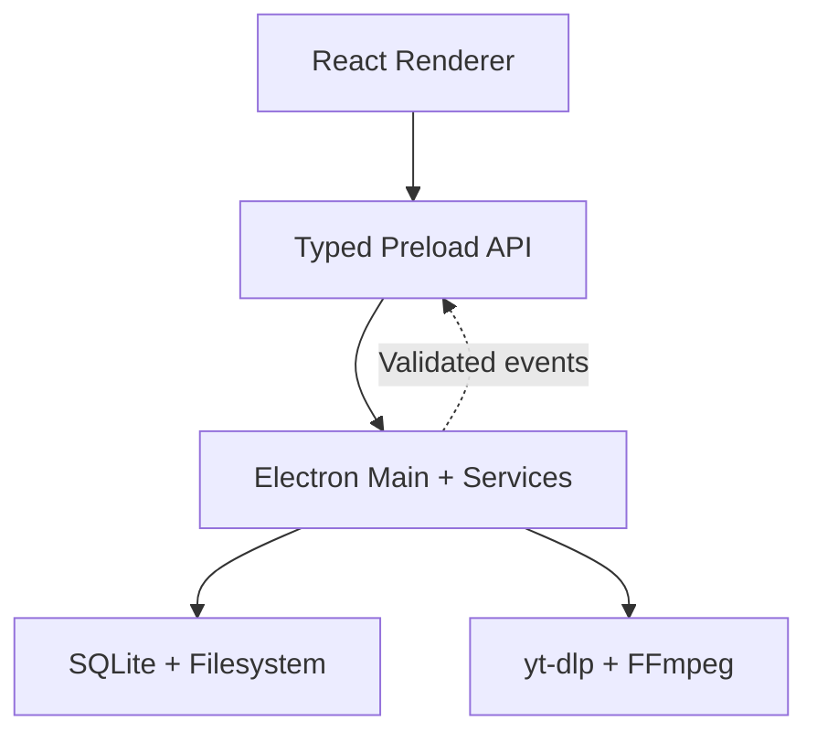

You are a senior desktop application architect and Electron engineer.

Build a production-oriented, cross-platform desktop application named **Arima**, based on the supplied requirements PDF and sample HTML UI.

Inputs:

- Requirements: `requirement-spec.pdf`
- UI reference: `index.html`
- Target platforms:
  - macOS Apple Silicon
  - macOS Intel
  - Windows x64

Arima is a local-first desktop media manager for content users are authorized to download. Its V1 workflow is:

**Import URL → Analyze → Select → Configure → Download → Organize → Watch → Resume**

The application must not bypass DRM or encourage unauthorized downloading.

## Working method

Work through the project one phase at a time.

For each phase:

1. Inspect the existing project before changing anything.
2. State assumptions and important architectural decisions.
3. List the files that will be created or modified.
4. Implement only the current phase.
5. Run relevant validation, linting, type checks, tests, or build commands.
6. Summarize the result and stop for approval before starting the next phase.

Do not generate the entire application in one response.

Do not overwrite working files unnecessarily. Preserve existing behavior and reuse appropriate existing code.

## Non-negotiable architectural rules

- Everything remains local by default.
- Do not create a cloud backend, REST server, Express server, remote database, authentication service, telemetry service, or user account system.
- Network access is used only when the user explicitly analyzes or downloads media, or checks for application updates.
- Store the SQLite database under Electron’s `userData` directory.
- Store downloaded media in a user-configurable directory.
- Keep thumbnails and relevant metadata locally after analysis/download.
- The renderer must never directly access Node.js, SQLite, the filesystem, or child processes.
- Enable `contextIsolation`, renderer sandboxing, and `nodeIntegration: false`.
- Use a narrow, typed preload API through `contextBridge`.
- Validate all IPC payloads with shared Zod schemas.
- Validate IPC senders and reject unsafe file paths or malformed URLs.
- Do not expose raw `ipcRenderer`, filesystem APIs, database connections, or unrestricted shell commands to React.
- Spawn executables using argument arrays with `shell: false`.
- Never interpolate user input into shell commands.
- Do not load executable remote UI content.
- Use a restrictive Content Security Policy.
- Compile Tailwind locally; do not use CDN dependencies.
- The UI must remain provider-independent.
- Do not implement DRM circumvention.
- Only current V1 requirements should be implemented. Future AI, transcript, quiz, flashcard, browser-extension, cloud-sync, and playlist-sync features should have clean extension boundaries but no V1 implementation.

## Phase 1 — Architecture and folder structure

Design a modular Electron architecture with four primary boundaries:

1. Renderer/presentation layer
2. Preload and typed IPC boundary
3. Main-process application/domain layer
4. Infrastructure and platform adapters

Use a structure similar to:

```text
arima/
├── build/
├── resources/
│   └── bin/
│       ├── darwin-arm64/
│       ├── darwin-x64/
│       └── win32-x64/
├── src/
│   ├── main/
│   │   ├── bootstrap/
│   │   ├── ipc/
│   │   ├── services/
│   │   │   ├── analysis/
│   │   │   ├── downloads/
│   │   │   ├── library/
│   │   │   ├── playback/
│   │   │   └── settings/
│   │   ├── domain/
│   │   ├── adapters/
│   │   │   ├── media-engine/
│   │   │   ├── filesystem/
│   │   │   └── platform/
│   │   ├── db/
│   │   │   ├── schema/
│   │   │   ├── migrations/
│   │   │   └── repositories/
│   │   ├── protocols/
│   │   └── windows/
│   ├── preload/
│   ├── renderer/
│   │   ├── app/
│   │   ├── routes/
│   │   ├── features/
│   │   │   ├── home/
│   │   │   ├── analyzer/
│   │   │   ├── downloads/
│   │   │   ├── library/
│   │   │   ├── player/
│   │   │   └── settings/
│   │   ├── components/
│   │   ├── stores/
│   │   ├── hooks/
│   │   ├── styles/
│   │   └── lib/
│   └── shared/
│       ├── contracts/
│       ├── schemas/
│       ├── types/
│       ├── constants/
│       └── errors/
├── tests/
│   ├── unit/
│   ├── integration/
│   └── e2e/
└── docs/
```

Do not create a monorepo unless the existing project already requires one.

Define interfaces for:

- `MediaEngine`
- `MediaAnalyzer`
- `DownloadManager`
- `DownloadQueue`
- `LibraryRepository`
- `SettingsRepository`
- `PlaybackProgressRepository`
- `FileStorage`
- `MediaProtocol`

The `yt-dlp` implementation must sit behind `MediaEngine`, so another compatible media provider can be introduced later.

Produce:

- Proposed folder tree
- Responsibilities of each layer
- IPC boundary design
- Initial database model
- Key architectural risks
- Architecture decision record

## Phase 2 — Technology identification

Confirm the final stack and explain each choice briefly.

Preferred baseline:

- Electron
- React
- TypeScript
- Tailwind CSS
- electron-vite
- React Router
- Zustand
- Zod
- SQLite
- better-sqlite3
- Drizzle ORM and Drizzle Kit
- electron-log
- electron-builder
- Vitest
- React Testing Library
- Playwright

Use current mutually compatible stable versions and lock resolved versions.

Document important trade-offs:

- Native `better-sqlite3` rebuilding and packaging
- Platform-specific `yt-dlp` and FFmpeg binaries
- macOS signing/notarization
- Windows installer signing
- media codec compatibility
- external-drive disconnection
- cross-platform pause/resume behavior

Do not introduce Next.js, NestJS, Express, PostgreSQL, Firebase, Supabase, or any unnecessary server framework.

## Phase 3 — High-level architecture and data design

Create `docs/architecture.md` containing Mermaid diagrams for:

1. Component architecture
2. URL-analysis sequence
3. Download lifecycle
4. Database/entity relationships

The high-level component diagram should represent:



Define a persistent download state machine:

```text
queued
→ analyzing
→ downloading
→ post_processing
→ completed
```

Alternative states:

```text
paused
failed
cancelled
interrupted
```

Define valid transitions and prevent invalid transitions.

For cross-platform consistency, treat Pause as:

1. Stop the active process safely.
2. Preserve partial files.
3. Persist queue state.
4. Resume by launching a new `yt-dlp` process with continuation enabled.

Do not depend on Unix-only process signals.

Design at least these SQLite tables:

- `collections`
- `media_items`
- `collection_items`
- `downloads`
- `playback_progress`
- `settings`

Include timestamps, stable IDs, indexes, uniqueness rules, foreign keys and migration strategy.

Prevent duplicate completed library items using provider/source identity and normalized source URL, without blocking intentional redownloads in a different format.

## Phase 4 — Project scaffolding and dependency installation

Scaffold the Electron + React + TypeScript application using electron-vite.

Use one package manager consistently, preferably `pnpm`.

Install dependencies in logical groups and explain their purposes.

Configure:

- TypeScript strict mode
- Path aliases
- ESLint and formatting
- Tailwind
- Electron main/preload/renderer entry points
- Secure `BrowserWindow` defaults
- CSP
- Database location
- Migration execution on startup
- Logging
- Development scripts
- Type checking
- Unit tests
- Packaged-build smoke tests

Configure electron-builder to package native modules correctly and unpack required `.node` binaries.

Add platform-specific `yt-dlp`, FFmpeg and FFprobe through `extraResources`.

Maintain a binary manifest containing:

- Tool name
- Version
- Platform
- Architecture
- Checksum
- Source
- License information

Do not download or update executables silently at application startup.

The scaffold is complete only when:

- Development mode opens successfully.
- Type checking passes.
- Tests run.
- SQLite initializes.
- A basic packaged application launches.

## Phase 5 — User interfaces

Before implementing UI, analyze the supplied sample HTML and extract:

- Color tokens
- Typography
- Spacing
- Border radius
- Shadows
- Navigation pattern
- Component patterns
- Empty, loading and error states
- Responsive/window-resizing behavior

Treat the sample HTML as the visual source of truth, but recreate it as maintainable React components. Do not paste the complete HTML into one React component.

Create the interfaces using mocked typed data first.

Required screens:

1. Application shell/sidebar
2. Home
3. URL analyzer
4. Single-media preview
5. Playlist preview and item selection
6. Download configuration
7. Downloads
   - Active
   - Queued
   - Completed
   - Failed

8. Library
9. Collection details
10. Media player
11. Settings
12. Dialogs, notifications and confirmation states

Required UI states:

- Empty
- Loading
- Success
- Validation error
- Unsupported source
- Offline/network failure
- Missing external drive
- Insufficient disk space
- Download interrupted
- Download failed
- No library results

Preserve the modern, minimal desktop appearance of the reference HTML.

Ensure keyboard accessibility, visible focus states, semantic controls, sufficient contrast and sensible behavior at small desktop window sizes.

Do not start backend integration during this phase.

## Phase 6 — Local logic and backend implementation

The Electron main process acts as the local application backend.

Implement in vertical slices:

### Slice 1: Settings and database

- SQLite initialization
- Migrations
- Default download directory
- Default quality and format
- Concurrency setting
- Library location
- Completion threshold
- Settings persistence

### Slice 2: URL analysis

- URL validation
- `yt-dlp` adapter
- Single-item and playlist analysis
- Normalized provider-independent metadata
- Timeout and cancellation
- Unsupported-source errors
- Local thumbnail caching

Do not download the full media file during analysis.

### Slice 3: Persistent queue

- Add selected items
- Configurable concurrency
- Progress parsing
- Speed, percentage, bytes and ETA
- Pause
- Resume
- Cancel
- Retry
- Crash recovery
- Application restart recovery
- Partial-file preservation
- Structured error codes

Persist important state transitions, but throttle frequent progress writes to avoid excessive SQLite writes.

### Slice 4: Download and post-processing

- Quality and format mapping
- Safe output paths
- Filename sanitization for macOS and Windows
- Playlist folder creation
- Ordered filename prefixes
- FFmpeg merging/conversion
- Disk-space checks
- External-storage availability checks
- Existing-file detection
- Atomic completion where possible

### Slice 5: Local library

- Register completed media
- Group playlist items into collections
- Collection progress
- Title search
- Remove database record only
- Remove record and physical file
- Storage-usage calculation

### Slice 6: Playback

- In-app HTML5 playback for supported media
- Range-capable custom local protocol for seeking
- Validated mapping from media IDs to local files
- Periodic watch-position persistence
- Resume watching
- 90% default completion threshold
- Continue Watching section
- External-player fallback for unsupported codecs

Never accept an unrestricted filesystem path from the renderer.

### Slice 7: Packaging and recovery

- macOS arm64 build
- macOS x64 build
- Windows x64 installer
- Native dependency validation
- Bundled binary validation
- Graceful cleanup on shutdown
- Queue recovery after forced termination
- Missing-media-file handling

## IPC contract requirements

Organize typed IPC operations by domain:

- `analysis.*`
- `downloads.*`
- `library.*`
- `player.*`
- `settings.*`
- `dialog.*`
- `app.*`

Use request/response IPC for commands and queries.

Use main-to-renderer events for:

- Download progress
- Download status changes
- Queue changes
- Storage problems
- Media-engine errors
- Update availability

Every exposed method must have:

- Typed request
- Typed success result
- Structured error result
- Runtime validation
- Listener cleanup function where applicable

## Testing requirements

Add tests for:

- URL validation
- Filename sanitization
- Download state transitions
- Queue concurrency
- Retry behavior
- Duplicate detection
- Playlist ordering
- Database migrations
- Playback completion calculation
- Path traversal prevention
- IPC validation
- Missing external storage
- Resume after restart

Provide at least one E2E happy-path test using a mocked media engine:

```text
Paste URL
→ Analyze
→ Select media
→ Configure download
→ Complete mocked download
→ Find item in library
→ Open player
→ Save playback position
→ Restart application
→ Resume playback
```

Do not make automated tests depend on live YouTube or another third-party service.

## Definition of done

V1 is complete only when a user can:

- Install Arima without separately installing technical dependencies.
- Paste and analyze a supported authorized-media URL.
- Preview a video or playlist.
- Select playlist items.
- Choose quality, format and location.
- Queue and download media.
- View reliable progress.
- Pause, resume, cancel and retry.
- Recover an interrupted queue after restart.
- Find completed media in an organized local library.
- Play supported media.
- Close and reopen Arima.
- Continue watching from the previous position.
- Complete the same core workflow on macOS and Windows.

Maintain a requirements traceability document mapping implementation and tests back to the supplied functional requirements, including FR-001 through FR-054.
