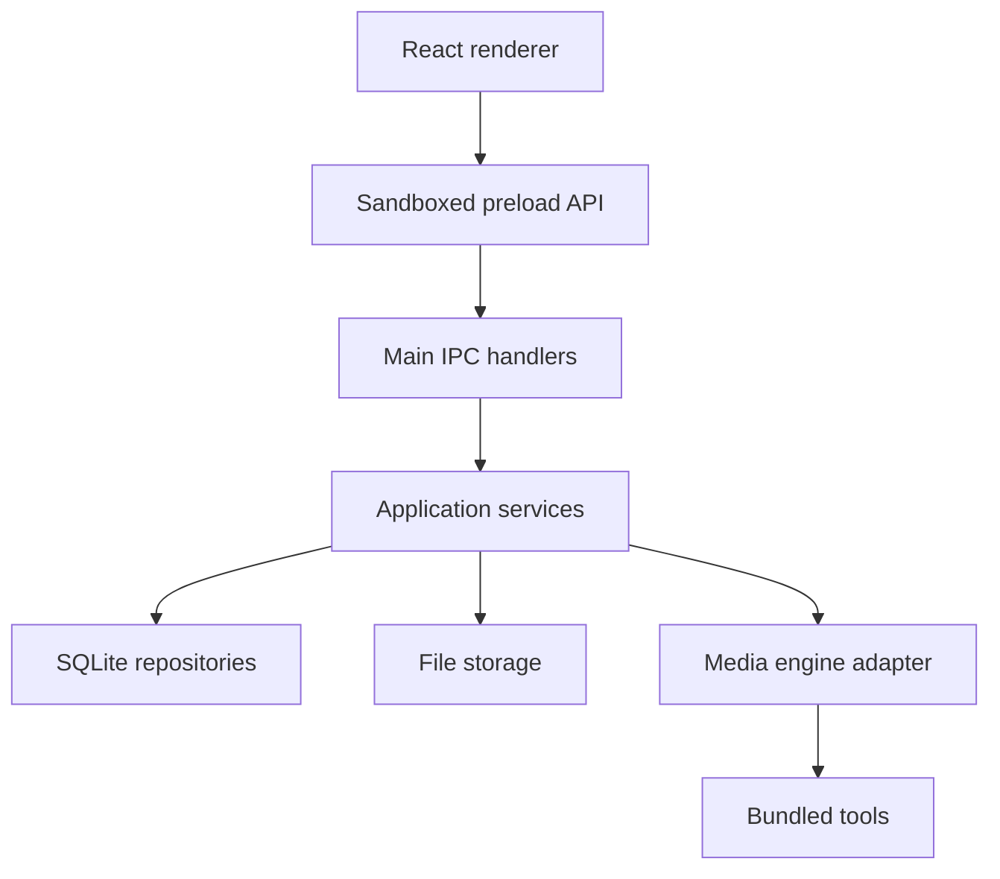
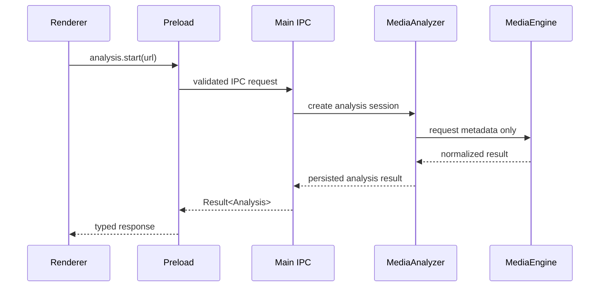
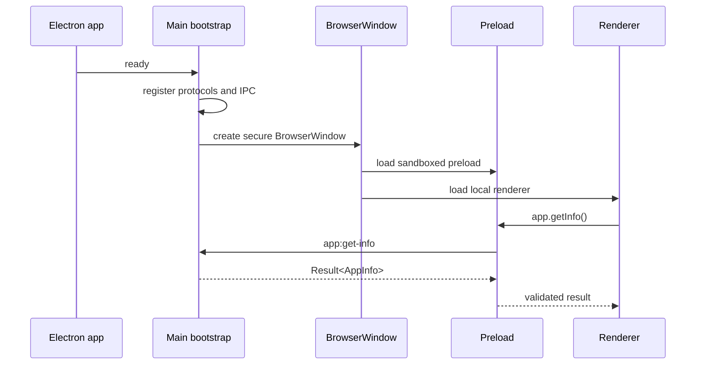
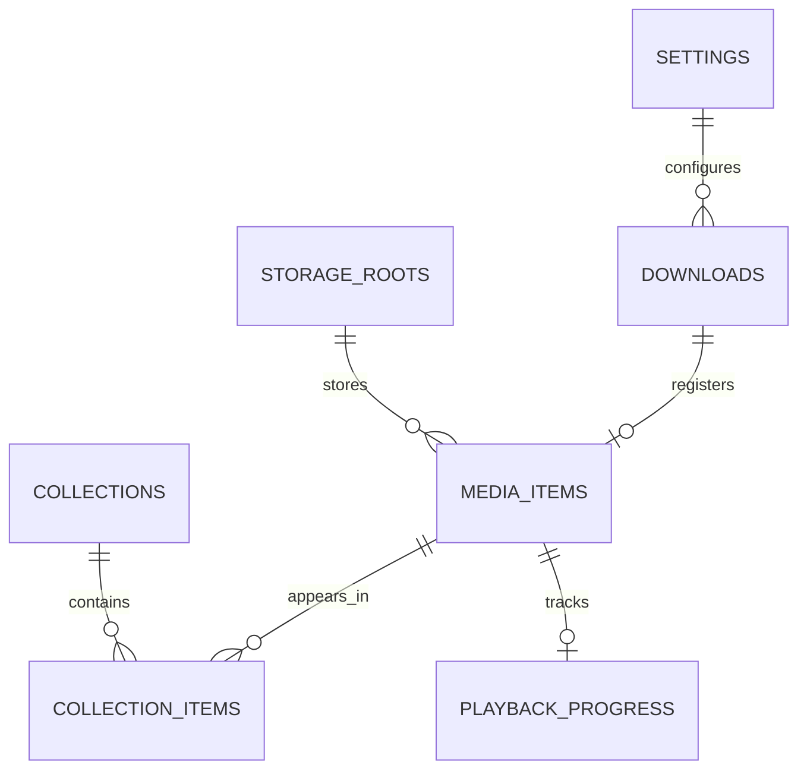

# Arima Architecture

Phase 1 establishes the secure application skeleton. It does not implement media analysis,
downloads, persistence, playback, packaged binaries, or updates.

## Component Boundaries

- Renderer code owns presentation only and cannot access Node, Electron, files, processes, or SQLite.
- Preload exposes named validated methods under `window.arima`.
- Main process owns privileged capabilities, validates senders, and composes services.
- Repositories, storage, media-engine, and tool adapters are introduced in later phases.

## Analysis Flow

Phase 1 implements only the IPC pattern with `app.getInfo`; analysis is documented here so later
phases keep provider behavior behind service and adapter boundaries.

## Lifecycle

## Entity Direction

The database is designed in Phase 1 and initialized in Phase 2. SQLite remains in Electron
`userData`; media files are stored under approved roots owned by the main process.
